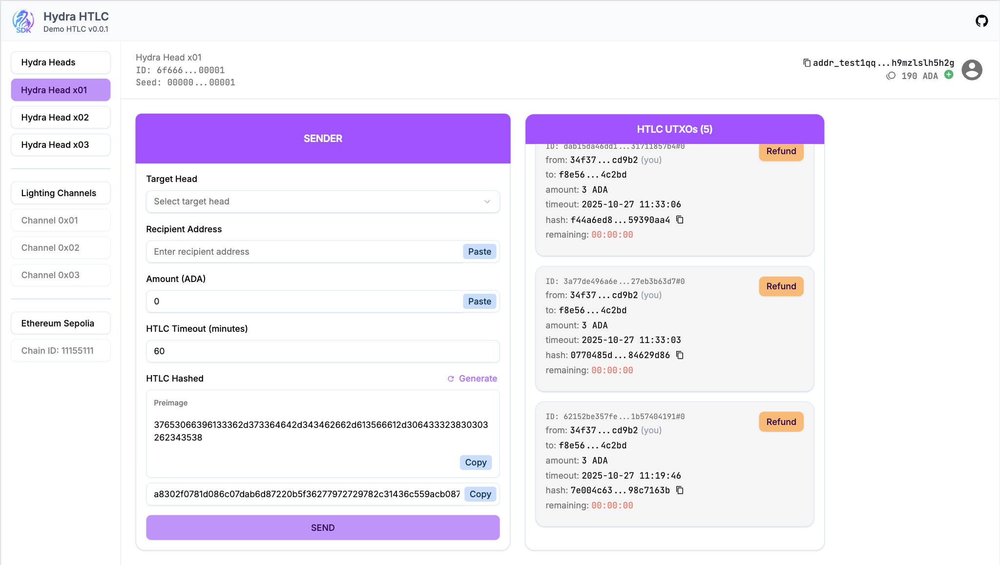
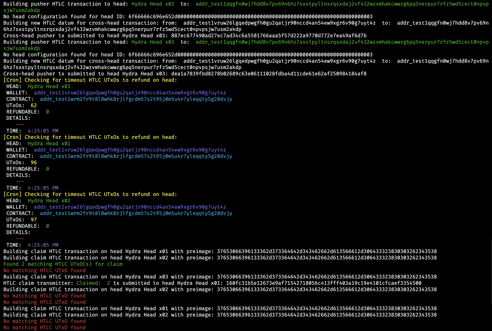

# Hydra HTLC Demo

> **Demo về Cross-Head HTLC (Hash Time-Locked Contract) trên Cardano Hydra Heads**

Demo video:





Project này demo cách triển khai và sử dụng HTLC (Hash Time-Locked Contract) để thực hiện atomic swap giữa các Hydra Heads khác nhau. Đây là một giải pháp Layer 2 cho phép thanh toán nhanh chóng và an toàn giữa các kênh thanh toán riêng biệt.

## 🎯 Tính Năng Chính

- ✅ **Cross-Head Transactions**: Chuyển tài sản giữa các Hydra Heads khác nhau
- 🔐 **HTLC Smart Contract**: Đảm bảo giao dịch atomic (hoặc thành công hoàn toàn, hoặc hoàn tiền)
- ⏱️ **Timeout Protection**: Tự động refund sau khi hết thời gian lock
- 🤖 **Automated Watcher**: Service tự động theo dõi và xử lý các giao dịch HTLC
- 🎨 **Web Interface**: Giao diện người dùng thân thiện để tương tác với HTLC

## 🏗️ Kiến Trúc

```
hydra-htlc-demo/
├── client/          # Frontend (Nuxt.js + Vue 3)
├── server/          # Backend (NestJS) - HTLC Watcher Service
├── onchain/         # Smart Contracts (Aiken)
├── infra/           # Infrastructure (Docker Compose cho Hydra Nodes)
└── docs/            # Documentation
```

### Components

1. **Client (Frontend)**
   - Framework: Nuxt 3 + Vue 3
   - UI: Shadcn/ui + Tailwind CSS
   - Tính năng: Tạo HTLC, Claim, Refund, Faucet

2. **Server (Backend)**
   - Framework: NestJS
   - Vai trò: Watcher service tự động xử lý cross-head transactions
   - Tự động refund timeout UTxOs mỗi 10 giây

3. **Onchain (Smart Contracts)**
   - Ngôn ngữ: Aiken
   - Contract: HTLC validator với Claim/Refund logic

4. **Infrastructure**
   - 3 Hydra Heads offline riêng biệt (mỗi Head có 1 node)
   - Chạy trên Docker containers

## 📋 Yêu Cầu Hệ Thống

- **Node.js** >= 18
- **pnpm** (package manager)
- **Docker** và **Docker Compose**
- **Aiken** (để compile smart contracts)

## 🚀 Cài Đặt

### 1. Clone Repository

```bash
git clone <repository-url>
cd hydra-htlc-demo
```

### 2. Cài Đặt Dependencies

#### Client
```bash
cd client
pnpm install
```

#### Server
```bash
cd ../server
pnpm install
```

## 🎮 Chạy Project

### Cách 1: Sử dụng Scripts (Khuyến nghị)

Project cung cấp các script để chạy dễ dàng:

```bash
# 1. Khởi động infrastructure (Hydra Heads)
./run-infra.sh

# 2. Khởi động server (Watcher Service)
./run-server.sh

# 3. Khởi động client (Web UI)
./run-client.sh
```

### Cách 2: Chạy Từng Phần Thủ Công

#### Bước 1: Khởi động Infrastructure

```bash
cd infra
docker-compose up
```

Điều này sẽ khởi động 3 Hydra Heads:
- Head 1: API port `4001`, WebSocket port `5001`
- Head 2: API port `4002`, WebSocket port `5002`
- Head 3: API port `4003`, WebSocket port `5003`

#### Bước 2: Khởi động Server

```bash
cd server
pnpm install
pnpm run start:dev
```

Server sẽ chạy ở port `3068` (mặc định).

#### Bước 3: Khởi động Client

```bash
cd client
pnpm install
pnpm dev
```

Client sẽ chạy ở `http://localhost:3000`.

## 💡 Cách Sử dụng

### 1. Truy cập Web Interface

Mở browser và truy cập: `http://localhost:3000`

Giao diện được chia làm 3 phần chính:
- **Sidebar trái**: Chọn Hydra Head và Lightning Channels
- **Panel giữa (SENDER)**: Form tạo HTLC transaction
- **Panel phải (HTLC UTXOs)**: Danh sách các HTLC đang active

### 2. Thông tin Wallet & Balance

Ở góc trên bên phải, bạn sẽ thấy:
- **Địa chỉ ví**: Click vào icon copy để sao chép địa chỉ
- **Balance**: Số dư ADA hiện tại của ví
- **Avatar**: Icon người dùng

### 3. Chọn Hydra Head

Ở sidebar bên trái, chọn Hydra Head bạn muốn sử dụng:
- **Hydra Head x01** (mặc định)
- **Hydra Head x02**
- **Hydra Head x03**

Mỗi Head sẽ hiển thị:
- **ID**: Head ID duy nhất
- **Seed**: Offline head seed

### 4. Tạo HTLC Transaction

Ở panel **SENDER** (giữa màn hình), điền các thông tin:

#### a. Target Head
- Chọn Hydra Head đích từ dropdown "Select target head"
- Đây là Head mà bạn muốn chuyển tiền đến

#### b. Recipient Address
- Nhập địa chỉ ví người nhận
- Có button **Paste** để dán từ clipboard

#### c. Amount (ADA)
- Nhập số lượng ADA muốn gửi (mặc định là 0)
- Có button **Paste** để dán giá trị

#### d. HTLC Timeout (minutes)
- Nhập thời gian timeout tính bằng phút (mặc định là 60)
- Sau thời gian này, HTLC có thể được refund

#### e. HTLC Hashed
- Click button **Generate** để tự động tạo preimage và hash
- Sẽ hiển thị 2 giá trị:
  - **Preimage**: Chuỗi secret gốc (button **Copy** để sao chép)
  - **Hash**: Giá trị hash của preimage (button **Copy** để sao chép)

#### f. Gửi Transaction
- Click button **SEND** màu tím ở cuối form
- Chờ transaction được xử lý

> **💡 Tip**: Lưu lại **Preimage** để người nhận có thể claim!

### 5. Xem HTLC UTXOs

Ở panel **HTLC UTXOs** (bên phải), bạn sẽ thấy danh sách các HTLC:

Mỗi HTLC hiển thị:
- **ID**: UTxO identifier
- **from**: Địa chỉ người gửi (có ghi chú "you" nếu là của bạn)
- **to**: Địa chỉ người nhận
- **amount**: Số lượng ADA
- **timeout**: Thời gian hết hạn (YYYY-MM-DD HH:MM:SS)
- **hash**: Hash của preimage (có icon copy)
- **remaining**: Thời gian còn lại (đếm ngược)

Mỗi HTLC có button **Refund** màu cam nếu bạn là người gửi.

### 6. Claim HTLC

Để claim HTLC:
1. Click vào HTLC item trong danh sách (nếu bạn là người nhận)
2. Dialog sẽ hiện ra yêu cầu nhập **Preimage**
3. Nhập preimage mà người gửi đã share cho bạn
4. Click **Claim** để nhận tiền
5. Transaction sẽ được xử lý bởi Watcher Service

> **⚠️ Lưu ý**: Chỉ claim được khi:
> - Bạn là người nhận (to address)
> - Chưa hết timeout
> - Preimage đúng

### 7. Refund HTLC

Để refund HTLC:
1. Click button **Refund** màu cam trên HTLC item
2. Refund chỉ có thể thực hiện khi:
   - Bạn là người gửi (from address)
   - Đã hết timeout (remaining: 00:00:00)
3. Watcher Service cũng tự động refund timeout HTLC mỗi 10 giây

### 8. Lighting Channels (Tùy chọn)

Ở sidebar, có section **Lightning Channels** với các channel:
- Channel 0x01
- Channel 0x02
- Channel 0x03

> **Note**: Feature này có thể dùng cho các kịch bản nâng cao

## 🔍 Workflow HTLC Cross-Head

```
User A (Head 1)                Watcher Service              User B (Head 2)
     |                               |                            |
     |--1. Create HTLC-------------->|                            |
     |   (lock funds)                |                            |
     |                               |--2. Detect & Push--------->|
     |                               |   (create HTLC on Head 2)  |
     |                               |                            |
     |                               |<--3. User B Claims---------|
     |                               |   (with preimage)          |
     |<--4. Auto Claim---------------|                            |
     |   (watcher claims on Head 1)  |                            |
     |                               |                            |
```

### Flow Chi Tiết:

1. **Lock Phase**: User A tạo HTLC trên Head 1
2. **Push Phase**: Watcher phát hiện và tạo HTLC tương ứng trên Head 2
3. **Claim Phase**: User B claim với preimage trên Head 2
4. **Auto-Claim Phase**: Watcher tự động claim trên Head 1 với cùng preimage
5. **Refund Phase** (nếu timeout): Watcher tự động refund về người gửi

## 📝 HTLC Smart Contract

Contract được viết bằng Aiken với 2 redeemer chính:

### Datum Structure

```aiken
pub type HtlcDatum {
  hash: ByteArray,        // Hash của preimage
  timeout: Int,           // Thời gian timeout (POSIX timestamp)
  sender: ByteArray,      // Payment key hash của người gửi
  receiver: ByteArray,    // Payment key hash của người nhận
}
```

### Redeemers

1. **Claim(preimage)**:
   - Kiểm tra hash(preimage) == datum.hash
   - Phải trước timeout
   - Phải được ký bởi receiver

2. **Refund**:
   - Phải sau timeout
   - Phải được ký bởi sender

## 🛠️ Tech Stack

### Frontend
- **Nuxt 3**: Vue framework
- **TypeScript**: Type-safe development
- **Shadcn/ui**: UI components
- **Tailwind CSS**: Styling
- **@hydra-sdk**: Cardano Hydra SDK
- **Pinia**: State management

### Backend
- **NestJS**: Node.js framework
- **TypeScript**: Type-safe development
- **@hydra-sdk**: Cardano Hydra SDK
- **Axios**: HTTP client
- **Blakejs**: Hashing library

### Smart Contracts
- **Aiken**: Cardano smart contract language
- **Plutus V3**: Plutus platform version

### Infrastructure
- **Docker**: Containerization
- **Hydra Node**: Cardano Hydra head protocol implementation

## 📂 Cấu Trúc Thư Mục Chi Tiết

```
hydra-htlc-demo/
├── client/
│   ├── components/           # Vue components
│   │   ├── FormHtlcSender.vue
│   │   ├── HtlcUtxos.vue
│   │   ├── ClaimDialog.vue
│   │   └── RefundDialog.vue
│   ├── composables/         # Vue composables
│   ├── pages/               # Nuxt pages
│   ├── stores/              # Pinia stores
│   └── nuxt.config.ts
│
├── server/
│   └── src/
│       ├── hydra-htlc/     # HTLC Watcher Service
│       │   └── index.ts
│       ├── configs/         # Configuration
│       └── main.ts
│
├── onchain/
│   └── validators/
│       └── htlc.ak         # HTLC Smart Contract
│
└── infra/
    ├── docker-compose.yaml  # Hydra Nodes setup
    ├── credentials/         # Keys cho Hydra Heads
    │   ├── single-head-1/
    │   └── single-head-2/
    └── protocol-parameters.json
```

## 🔧 Configuration

### Server Configuration

File: `server/src/configs/index.ts`

```typescript
export const srcHead: HydraHeadConfig = {
  name: 'single-head-1',
  httpUrl: 'http://localhost:4001',
  wsUrl: 'ws://localhost:4001',
};

export const destHead: HydraHeadConfig = {
  name: 'single-head-2', 
  httpUrl: 'http://localhost:4002',
  wsUrl: 'ws://localhost:4002',
};
```

### Client Configuration

File: `client/composables/useConfigs.ts`

Cấu hình API endpoints và Hydra Head connections.

## 🧪 Testing

### Manual Testing Flow

1. Khởi động tất cả services
2. Request faucet để có test funds
3. Tạo HTLC transaction với timeout 5 phút
4. Quan sát Watcher Service tự động push sang Head 2
5. Claim với preimage từ UI
6. Xác nhận funds đã được transfer thành công

## 🐛 Troubleshooting

### Issue: Hydra Heads không khởi động

**Solution**: 
```bash
cd infra
docker-compose down -v
docker-compose up
```

### Issue: Không thấy UTxOs trong client

**Solution**: 
- Kiểm tra connection đến Hydra WebSocket
- Refresh lại trang
- Kiểm tra console logs

### Issue: Transaction không được confirm

**Solution**:
- Kiểm tra Watcher Service logs
- Xác nhận có đủ funds cho transaction
- Kiểm tra timeout chưa hết hạn

## 📚 Tài Liệu Tham Khảo

- [Hydra SDK by VTechcom](https://hydrasdk.com) - TypeScript SDK cho Cardano Hydra
- [Hydra Documentation](https://hydra.family/)
- [Aiken Language Guide](https://aiken-lang.org/)
- [Cardano Developer Portal](https://developers.cardano.org/)
- [HTLC Explained](https://en.bitcoin.it/wiki/Hash_Time_Locked_Contracts)

## 🤝 Contributing

Contributions are welcome! Please feel free to submit a Pull Request.

## 📄 License

Apache-2.0

## 👥 Authors

Vtechcom Team

---

**Note**: Đây là demo project cho mục đích học tập và nghiên cứu. Không sử dụng trong production mà chưa kiểm tra bảo mật kỹ lưỡng.
